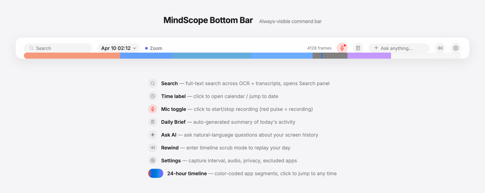

# MindScope

**Your screen memory. Never forget what you saw, heard, or discussed.**

MindScope runs silently in the background, capturing your screen and audio into a searchable, structured knowledge base — processed entirely on your Mac.

<p align="center">
  
</p>

---

## Install

1. Download `MindScope_0.1.0_aarch64.dmg` from [Releases](https://github.com/xanthiawang/mindscope/releases/latest) and drag to Applications.
2. Grant **Screen Recording** and **Microphone** in System Settings → Privacy & Security.
3. Install `ffmpeg` for audio recording — `brew install ffmpeg`.
4. *(Optional)* Install `claude` CLI for AI features — `brew install claude`.

**Requirements:** macOS 11+ (tested on Sequoia 15), Apple Silicon recommended.

---

## The Bar

MindScope lives as a thin bar at the bottom of your screen. Everything starts here.

<p align="center">
  
</p>

| Element | Action |
|---|---|
| **Search** | Full-text search across OCR and meeting transcripts |
| **Time label** | Click to open the calendar and jump to any date |
| **Mic toggle** | Start/stop recording manually (red pulse = recording) |
| **Daily Brief** | Auto-generated summary of today's activity |
| **Ask AI** | Natural-language questions about your screen history |
| **Rewind** | Enter timeline scrub mode to replay your day |
| **Settings** | Capture interval, audio, privacy, excluded apps |
| **24-hour timeline** | Click or drag to jump to any moment; time pill follows your cursor |

Press `Esc` to hide the UI — background recording keeps running.

---

## Core Concepts

### Timeline & Rewind

The bottom bar shows a full 24-hour day at once with color-coded app segments and 3-hour tick marks. Click anywhere to jump to that moment; a red scrubber marks your current position. In rewind mode, a time pill follows your mouse showing the exact minute at the cursor, and two-finger swipe scrolls through history. Rewind past midnight to cross into the previous day.

### Search

Full-text FTS5 search runs against OCR-extracted text from every frame. Results highlight matching regions with yellow boxes on the screenshot. Filter by app, date range, or switch to the Meetings tab to browse session transcripts.

### Meetings

MindScope auto-detects active meetings by combining two signals: a known meeting app is running (Zoom, Tencent Meeting, Teams, Google Meet, Webex, FaceTime, Lark, DingTalk, WeMeet, Discord) **and** the microphone is actively in use. Both must be true to avoid false positives from dictation tools like Wispr Flow or superwhisper.

When detected, MindScope streams audio to a local multilingual Whisper model (`ggml-base.bin`, 141 MB, Metal-accelerated on Apple Silicon). Transcripts appear in real time in the AI panel's Transcript tab. End-to-end latency is 2–4 seconds.

**Sessions are activity-based, not time-based:** one Zoom meeting = one session, even if it spans hours. A manual 10-minute recording is a separate session. Find them under Search → Meetings as clickable cards with colored app badges and full transcripts.

### Synapse — built-in knowledge OS

On first launch, MindScope bootstraps a local AI loop called Synapse into `~/.mindscope/synapse/` and seeds `~/.mindscope/vault/` with a working-memory template. Every 30 minutes (or on-demand via the Brief panel's Refresh button), Synapse reads your recent screen activity + meeting transcripts and asks Claude CLI to update `_working-memory.md` with the current Focus, Tasks, Today's Activity, and Recent People.

The Daily Brief reads from this file, so the more you use MindScope, the more contextual the Brief becomes. Synapse ships with bundled skills (`command-center`, `daily-journal`, `detect-people`, `dendron-add/query`, `vault-updater`) that Claude uses to maintain vault files. No external install, no OAuth, no cloud.

---

## Privacy & Data

Everything is local. No data leaves your Mac. All files live under `~/.mindscope/`:

```
~/.mindscope/
├── data/
│   ├── frames/          # JPEG screenshots by date
│   ├── segments/        # HEVC video
│   ├── audio/           # Audio chunks + transcripts
│   └── mindscope.db     # SQLite + FTS5 index
├── vault/               # Markdown knowledge base
│   ├── _working-memory.md
│   ├── meet.*.md        # Auto-created per session
│   ├── daily.journal.*.md
│   └── user.*.md
├── synapse/             # AI skill definitions
├── models/
│   └── ggml-base.bin    # Multilingual Whisper
├── bin/                 # Swift helpers
└── settings.json
```

**Typical storage:** ~400 MB/day with default settings. Adjust retention in Settings.

**Privacy features:** PII auto-redaction (credit cards, IDs, phone numbers), configurable app exclusion list, private browsing mode that skips Incognito windows. MindScope is also self-excluded from its own captures.

---

## Build from Source

```sh
git clone https://github.com/xanthiawang/mindscope.git
cd mindscope
npm install
MACOSX_DEPLOYMENT_TARGET=11.0 npx tauri build
```

Output at `src-tauri/target/release/bundle/dmg/MindScope_0.1.0_aarch64.dmg`.

---

## Troubleshooting

**Screenshots show only the desktop wallpaper.** TCC Screen Recording permission is stale. Run `tccutil reset ScreenCapture com.mindscope.rewind`, re-grant under System Settings, then quit and relaunch.

**Meeting detected but no transcription.** Check `ffmpeg` is installed at `/opt/homebrew/bin/ffmpeg` and the Whisper model exists at `~/.mindscope/models/ggml-base.bin`.

**MindScope not in Privacy → Microphone.** Click the mic button in the bar — macOS will show the permission dialog on first use.

**Synapse loop not updating working memory.** Install Claude CLI (`brew install claude`) and verify it runs without errors in `~/.mindscope/vault/`.

---

## License

MIT — Copyright (c) 2026 Zixin Wang
