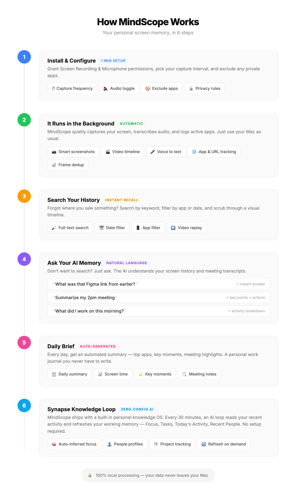

# MindScope

**Your AI-powered digital memory. Never forget what you saw, heard, or discussed.**

MindScope runs silently in the background, capturing your screen activity and transforming it into searchable, structured knowledge — all processed locally on your Mac.

---

## How It Works

<p align="center">
  
</p>

---

## Quick Start

### 1. Install

Download `MindScope_0.1.0_aarch64.dmg` from [Releases](https://github.com/xanthiawang/mindscope/releases). Open the DMG and drag MindScope to Applications.

### 2. Grant Permissions

On first launch, grant **two permissions**:

1. **Screen Recording** — System Settings → Privacy & Security → Screen & System Audio Recording → toggle on MindScope
2. **Microphone** — A dialog pops up automatically the first time a meeting is detected. Click Allow. (Or pre-grant it under System Settings → Privacy & Security → Microphone)

> After granting Screen Recording, you must **quit and reopen MindScope** for it to take effect.

### 3. Launch

MindScope lives as a thin bar at the bottom of your screen. Click anywhere on the bar to reveal controls.

---

## Daily Workflow

### Bottom Bar at a Glance

```
[ 🕐 time ][ app ]               [ N frames ][ 🎙️ ][ 📋 ][ ✨ Ask ][ ⏪ ][ ⚙️ ]
            └ current activity              │     │     │        │     │
                                            │     │     │        │     └ Settings
                                            │     │     │        └ Rewind mode
                                            │     │     └ AI chat input
                                            │     └ Daily Brief
                                            └ Mic toggle (red pulse = recording)
```

| Action | How |
|--------|-----|
| **Toggle recording audio** | Click the 🎙️ mic button (turns red + pulses when recording) |
| **Open Daily Brief** | Click the 📋 clipboard icon |
| **Ask AI** | Click the "Ask" field, type a question, press Enter |
| **Enter Rewind mode** | Click the ⏪ rewind button or click anywhere on the timeline |
| **Scrub timeline** | Click or drag anywhere on the bottom bar (full 24h visible) |
| **Browse history** | Two-finger swipe on the timeline |
| **Jump to date** | Click the time label for a calendar picker |
| **Search** | In Rewind mode, click the search field |
| **Settings** | Click the ⚙️ gear icon |
| **Hide window** | Press `Esc` or click outside any panel |

### Timeline

The bottom bar shows **a full 24-hour day** at once. Every segment on the bar is a different app (color-coded). Click any point to jump to that moment. Hour ticks every 3 hours help you locate time ranges.

### Search Screen History

In Rewind mode, click the search field and type anything you remember — a keyword, a phrase, a URL. FTS5-powered full-text search scans OCR-extracted text from every frame and highlights matches with yellow boxes.

Filter by app or by date using the dropdowns.

### Ask AI About Your Screen

Type a natural-language question in the "Ask" field:
- *"What did I work on this morning?"*
- *"Find the Figma link my coworker shared"*
- *"Summarize my Zoom meeting at 2pm"*

The AI uses your screen history + OCR text + meeting transcripts + vault knowledge to answer.

### Daily Brief

Click the 📋 clipboard icon for an auto-generated summary:

- **Now** — currently active app and window
- **Today** — top 5 apps with time breakdown
- **Recent Meetings** — last 3 meeting sessions with type, date, title
- **Focus / Tasks** — from `~/.mindscope/vault/_working-memory.md` (if present)
- **Stats** — frame count, apps touched, active minutes

---

## Meeting & Audio Recording

### Automatic Meeting Detection

MindScope auto-starts recording when it detects you're **actively in a meeting** (not just that an app is open). Detection uses:

1. **NSWorkspace** — is Zoom / Tencent Meeting / Teams / Lark / etc. running?
2. **CoreAudio** — is the default microphone input device *currently in use*?

Both conditions must be true → MindScope starts a new audio session.

Supported meeting apps:
- Zoom, Microsoft Teams, Google Meet, Webex, FaceTime, Skype, Discord
- Tencent Meeting (腾讯会议), Lark (飞书), DingTalk (钉钉), WeMeet

### Manual Recording

Click the 🎙️ mic button in the bottom bar to start/stop recording at any time. The button:
- **Gray** — not recording
- **Red + pulsing dot** — recording (manual or auto)

Clicking the red button stops recording immediately (within ~200ms).

### Real-Time Transcription

Audio is transcribed in real time using a local Whisper model (`ggml-base.bin`, 141MB, multilingual — supports Chinese and 97 other languages). Latency: **2.5 – 3.5 seconds** end-to-end.

- **Metal GPU accelerated** on Apple Silicon
- **Streaming PCM pipeline** — no file I/O between ffmpeg and Whisper
- **Cross-segment dedup** — kills hallucination loops
- **RMS silence gate** — skips empty audio

Real-time transcripts appear in the AI panel's **Transcript** tab while a meeting is running.

### Meeting Sessions

Sessions are defined by **activity**, not time:
- One Zoom meeting = one session
- One Tencent Meeting = one session
- A manual 10-minute recording = another session

Find all past sessions under **Search → Meetings**. Each session is a clickable card with:
- Colored app badge (Zoom blue, Tencent green, Teams purple, Manual orange, unknown apps indigo)
- Duration and segment count
- Transcript preview

Click a card to open the **full transcript** in a detail modal with a "Copy All" button.

### Privacy Suppression

Clicking the mic button during an auto-recorded meeting stops it and suppresses auto-restart for the rest of that meeting. Auto-recording resumes normally for the next meeting.

---

## Features

### Screen Recording
- **HEVC video** encoding (Apple Silicon hardware accelerated)
- **Smart frame dedup** (histogram + perceptual hash) saves 60%+ storage
- **Full-text OCR** — English + Chinese, yellow highlight boxes on search results
- **Multi-monitor** support — automatically picks the monitor with the most content
- **App exclusion list** — configurable in Settings
- **MindScope self-excluded** from its own captures

### Timeline & Rewind
- Full 24-hour day view on the bottom bar (scale by time, not frame count)
- Hour tick marks every 3 hours
- Two-finger swipe, click-to-scrub, arrow key navigation
- Calendar picker to jump to any date
- Cross-day scrolling (auto-loads previous/next day)

### Meeting Intelligence
- Smart detection: meeting app running **AND** mic actively in use
- Activity-based session grouping
- Real-time multilingual Whisper transcription (Metal-accelerated)
- Cross-segment deduplication
- Auto-generated meeting notes to Knowledge Vault (via Claude CLI if installed)

### AI Assistant
- Chat + Transcript tabs in the AI panel
- Natural-language Q&A over screen history + vault + meeting transcripts
- Daily Brief with 5 sections (Now / Today / Recent Meetings / Focus / Tasks)
- Quick actions during meetings: "What should I say?", "Recap", "Follow-up questions"

### Knowledge Vault
- People profiles with auto-updated last contact dates
- Meeting notes linked to attendees and projects
- Daily journal auto-generated at end of day
- Cross-references via wikilinks (Obsidian-compatible markdown)

### Automation (Pipes)
- YAML-defined pipelines with cron schedules
- Built-in: Daily Summary, Meeting Notes
- Output to clipboard, file, or notification

### Privacy
- **100% local processing** — nothing uploaded
- PII auto-redaction (credit cards, IDs, phone numbers)
- App exclusion list
- Private browsing mode (skip Incognito windows)

---

## Data Storage

All data lives under `~/.mindscope/`:

```
~/.mindscope/
├── data/
│   ├── frames/         # Screenshots (JPEG, organized by date)
│   ├── segments/       # HEVC video segments
│   ├── audio/          # Audio chunks + transcripts, indexed by date
│   └── mindscope.db    # SQLite database (frames, OCR, FTS5 index)
├── vault/              # Knowledge vault (markdown)
│   ├── meet.*.md         # Meeting notes
│   ├── daily.journal.*.md  # Daily journals
│   └── _working-memory.md  # Your current focus + tasks
├── models/
│   └── ggml-base.bin   # Multilingual Whisper model
├── bin/                # Compiled Swift helpers
│   ├── active_app
│   ├── is_meeting
│   ├── check_mic
│   ├── topmost_window
│   └── hevc_encoder
└── pipes/              # Automation YAML configs
```

Typical storage: **~400MB / day** with default settings.

---

## Architecture

```
┌──────────────────────────────────────────────────────────┐
│                    MindScope (Tauri 2)                    │
├──────────────────────────────────────────────────────────┤
│  Frontend (React + TypeScript)                           │
│  ┌──────────┐ ┌──────────┐ ┌──────────┐ ┌────────────┐ │
│  │ Timeline │ │  Search  │ │    AI    │ │  Settings  │ │
│  │   Bar    │ │  Panel   │ │  Panel   │ │   Panel    │ │
│  │ 24h view │ │ Apps     │ │Chat│Trans│ │ General    │ │
│  │ Scrub    │ │ Meetings │ │ Quick   │ │ Audio      │ │
│  │ Rewind   │ │ Starred  │ │ Actions │ │ Privacy    │ │
│  └──────────┘ └──────────┘ └──────────┘ └────────────┘ │
│                                                          │
│  HTTP API (port 9457)         Tauri IPC (invoke)        │
├──────────────────────────────────────────────────────────┤
│  Backend (Rust)                                          │
│                                                          │
│  Recording Engine                                        │
│  ┌───────────┐ ┌──────────┐ ┌──────────┐ ┌───────────┐ │
│  │ Screenshot│ │  HEVC    │ │   OCR    │ │  Frame    │ │
│  │  (xcap)   │ │ Encoder  │ │ (Vision) │ │  Dedup    │ │
│  └───────────┘ └──────────┘ └──────────┘ └───────────┘ │
│                                                          │
│  Audio Engine (streaming pipeline)                       │
│  ┌───────────┐ ┌──────────┐ ┌──────────┐ ┌───────────┐ │
│  │  ffmpeg   │ │ PCM buf  │ │ whisper  │ │  Session  │ │
│  │  stdout   │→│ 2s+over  │→│ (Metal)  │→│  Tracker  │ │
│  └───────────┘ └──────────┘ └──────────┘ └───────────┘ │
│                                                          │
│  Meeting Detection (Swift helpers via CoreAudio)        │
│  ┌───────────┐ ┌──────────┐ ┌──────────┐ ┌───────────┐ │
│  │is_meeting │ │check_mic │ │topmost_  │ │ active_   │ │
│  │NSWorkspace│ │AVFound.  │ │ window   │ │   app     │ │
│  └───────────┘ └──────────┘ └──────────┘ └───────────┘ │
│                                                          │
│  Knowledge Layer                                         │
│  ┌───────────┐ ┌──────────┐ ┌──────────┐ ┌───────────┐ │
│  │  Vault    │ │  Daily   │ │ Working  │ │   Pipe    │ │
│  │  Sync     │ │ Journal  │ │ Memory   │ │ Scheduler │ │
│  └───────────┘ └──────────┘ └──────────┘ └───────────┘ │
│                                                          │
│  Storage: SQLite (FTS5) + JPEG + HEVC (.mp4)            │
└──────────────────────────────────────────────────────────┘
```

---

## Optional: AI Features

Install [Claude CLI](https://docs.anthropic.com/en/docs/claude-cli) to enable AI chat, meeting note generation, and daily brief synthesis:

```sh
brew install claude
```

Without Claude CLI, Search / Rewind / Timeline / Transcription all work normally; only AI chat + auto-generated meeting summaries are disabled.

---

## Build from Source

```sh
git clone https://github.com/xanthiawang/mindscope.git
cd mindscope
npm install
MACOSX_DEPLOYMENT_TARGET=11.0 npx tauri build
```

Output at `src-tauri/target/release/bundle/dmg/MindScope_0.1.0_aarch64.dmg`.

---

## Requirements

- **macOS 11.0+** (tested on macOS 15 Sequoia)
- **Apple Silicon** recommended (Metal GPU accelerates Whisper)
- **Screen Recording** + **Microphone** permissions
- **ffmpeg** for audio recording: `brew install ffmpeg`
- Optional: **Claude CLI** for AI features

---

## Troubleshooting

**Screenshots show only the desktop wallpaper**
Reset Screen Recording permission: `tccutil reset ScreenCapture com.mindscope.rewind`, then re-grant under System Settings. Quit and relaunch MindScope.

**Meeting detected but no transcription**
Check that `ffmpeg` is installed at `/opt/homebrew/bin/ffmpeg` or `/usr/local/bin/ffmpeg`. Verify the Whisper model exists at `~/.mindscope/models/ggml-base.bin`.

**Microphone not showing in Privacy settings**
MindScope only appears after the first mic-access attempt. Trigger it by clicking the mic button in the bar or joining a meeting — macOS will pop up the permission dialog once.

**Timeline shows "0 frames"**
Verify SQLite DB exists: `sqlite3 ~/.mindscope/data/mindscope.db "SELECT COUNT(*) FROM frames;"`. If non-zero, the frontend is reading the wrong date — check your timezone.

---

## License

MIT — Copyright (c) 2026 Zixin Wang
